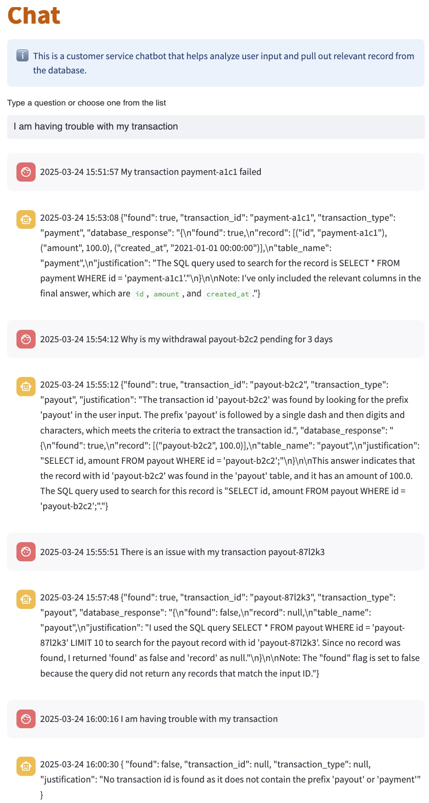

This is a customer service chatbot that helps analyze user input and pull out relevant record from the database.

The app is built with Langchain, Ollama and Streamlit.

What the chatbot exactly does?
- extract transaction id from user input
- determine transaction type based on the transaction id
- find record from database table based on transaction id and type

A transaction id may starts with `payment`, which indicates a payment transaction; or starts with `payout`, which indicates a payout transaction.

There are `payment` and `payout` tables in the database, each contains some records. Details can be found in `db.py`.

Prompts are fine tuned using following techniques for better result:
- clear instructions
- asking for justification
- use delimiters
- chain of thought


Example UI:


Steps to run
- Install Ollama server locally, and download the llama3 model (not llama3.2).
- Install Python dependencies by executing ```pip install -r requirements.txt```
- Start the app by executing the following command from the project root directory
```python -m streamlit run app.py --server.port=8501 --server.address=0.0.0.0```


## Examples of Prompt Engineering
### Bot returns example value when transaction id not found
The system prompt `extract_system_prompt` was defined as the following, which includes examples for payment and payout transaction id formats.
```python
extract_system_prompt = (
    "You are a customer officer that helps extract transaction id from the user input and determine the transaction type based on the transaction id. "
    "There are two types of transactions: payment and payout. "
    "1. A payout transaction, whose transaction id starts with 'payout_', "
    "===>START EXAMPLE"
    "payout_a1b2c3d4"
    "<===END EXAMPLE"
    "2. A payment transaction, whose transaction id starts with 'payment_', "
    "===>START EXAMPLE"
    "payment_a1b2c3d4"
    "<===END EXAMPLE"
    "===>START USER INPUT"
    "{input}"
    "<===END USER INPUT"
    "Respond with the following information: "
    "1. a flag named found which indicates if a transaction id is found "
    "2. the transaction id named transaction_id if found "
    "3. the transaction type (in lower case) named transaction_type if found "
    "4. the explanation named justification which explains how you deduce transaction id and transaction type "
    "You must give answer in JSON format without any extra content, and don't make up information."
)
```

The bot sometimes gives wrong answer that returns the example value or unrelated text when it cannot find a transaction id in the user input.

input:
My transaction failed

wrong answer1: 
{ "found": true, "transaction_id": "payment_a1b2c3d4", "transaction_type": "payment", "justification": "The transaction id starts with 'payment_', which indicates it's a payment transaction." }

wrong answer2:
{"found": true, "transaction_id": "My transaction", "transaction_type": "payment", "justification": "The transaction id 'My transaction' starts with 'payment_', indicating a payment transaction." }

solution:
Examples are removed.

```python
extract_system_prompt = (
    "You are a customer officer that helps extract transaction id from the USER INPUT and determine the transaction type based on the transaction id. "
    "A transaction id can take one of two forms: "
    "1. A transaction id may start with 'payout_', which indicates a payout transaction. "
    "2. A transaction id may start with 'payment_', which indicates a payment transaction. "
    "===>START USER INPUT"
    "{input}"
    "<===END USER INPUT"
    "Respond with the following information: "
    "1. a flag named found, it is true if you can find a transaction id in the USER INPUT, otherwise it is false "
    "2. the transaction id named transaction_id if found "
    "3. the transaction type (in lower case) named transaction_type if found "
    "4. the explanation named justification which explains how you deduce transaction id and transaction type "
    "You must give answer in JSON format without any extra content, and don't make up transaction id if no exact text appears in the USER INPUT."
)
```

### bot treats invalid transaction id as valid
The system prompt `extract_system_prompt` was defined as the following, which includes detailed steps to verify and extract transaction id.
```python
extract_system_prompt = (
    "You are a customer officer that helps extract transaction id from the USER INPUT and determine the transaction type based on the transaction id. "
    "To find transaction id, follow all the steps below: "
    "Step 1. **Look for prefix**: for each word in the USER INPUT, check if it starts with 'payout' or 'payment', if so, you should go to Step 2, otherwise go to Step 7. "
    "Step 2. **Find a single dash**: check the character immediately after the prefix 'payout' or 'payment', if it is a dash, you should go to Step 3, otherwise go to Step 7.. "
    "Step 3. **Find digits and characters**: check if there is at least one digit or one character after the dash, if so, you should go to Step 4, otherwise go to Step 7.. "
    "Step 4. **Extract transaction id**: extract transaction id from the USER INPUT, then go to Step 5. "
    "Step 5. **Verify transaction id**: verify the extracted transaction id by checking if the USER INPUT contains exact the same text, if so, you should go to Step 6, otherwise go to Step 7. "
    "Step 6. It is a valid transaction id, when constructing the response, return the flag found as true. "
    "Step 7. It is not a valid transaction id, when constructing the response, return the flag found as false. "
    "To determine the transaction type, follow the rule below: "
    "There are two types of transactions: "
    "a. A transaction id starting with 'payout' indicates a payout transaction. "
    "b. A transaction id starting with 'payment' indicates a payment transaction. "
    "===>START USER INPUT"
    "{input}"
    "<===END USER INPUT"
    "Respond with the following information: "
    "1. a flag named found, which indicates if a valid transaction id is found "
    "2. the transaction id named transaction_id if found "
    "3. the transaction type (in lower case) named transaction_type if found "
    "4. the explanation named justification which explains how you deduce transaction id and transaction type "
    "You must give answer in JSON format without any extra content, and don't make up transaction id if no exact text appears in the USER INPUT."
)
```

The bot treats invalid transaction id such as payment3 or payout5 as valid.

input:
My payment3 failed

(here payment3 is not a valid transaction id since there is no dash after 'payment')

wrong answer: 
{"found": true, "transaction_id": "payment-", "transaction_type": "payment", "justification": "The user input contains a string pattern that matches a valid transaction id starting with 'payment-' and followed by a single dash."}

possible solutions (not implemented yet):
- Use Python REPL tool with Regex instead of describing rules in prompt, or 
- Use a better LLM (my test is using llama3), or 
- Split the complex prompt into multiple smaller prompts then feed each prompt into a LLM.


### SQL agent returns error "Invalid Format: Missing 'Action:' after 'Thought:"

solution:
create SQL agent every time for every user input, i.e. do not reuse SQL agent.
